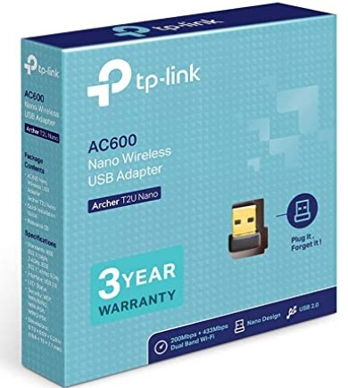

# Ubuntu18 TP-Link AC600 Setup

This is for the issue that `TP-LINK`'s wireless network adapter `AC600` is not automatically set up in Ubuntu 18.

(Image from Amazon.co.uk)

**Issue:** 
Even though plugged, AC600 is not automatically detected at all on Ubuntu 18. A proper driver is required.

**Remedy:**
1. Go to https://github.com/aircrack-ng/rtl8812au and download the files by [Code]-[Download ZIP]
2. Extract the zip file to a directory.
3. As instructed in the repository, run `$ sudo make dkms_install` in the root directory. (`dkms` package is required to perform this)
4. Plug (re-plug) the usb dongle to the computer, and then you should be able to see it is working listing available wifi networks around. 